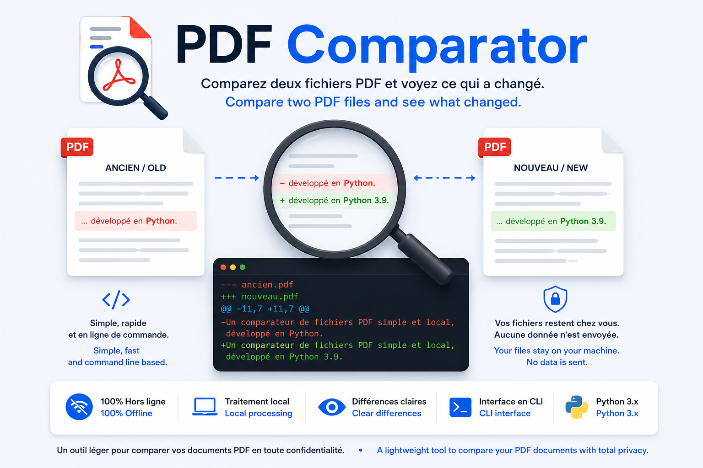

<p align="center">
  
</p>

> 🇫🇷 Français | [🇬🇧 English](./README.md)


[](https://www.youtube.com/@Palks_Studio)
[](https://www.linkedin.com/in/palks-studio/)

<p align="center">
  <a href="https://palks-studio.com">
    
  </a>
</p>

# PDF Comparator

Un comparateur de fichiers PDF simple et local, développé en Python.

L'outil extrait le contenu textuel de deux documents PDF, normalise légèrement les données puis affiche les différences détectées entre les deux versions.

Aucune IA, aucune API externe et aucun envoi de fichier vers un service tiers.

---

## Structure

```text
pdf-comparator/
├── pdf-compare.py                 → Script principal de comparaison PDF
├── requirements.txt               → Dépendances Python requises
├── LICENSE.md                     → Licence MIT
├── README.md                      → Documentation anglaise
├── README_FR.md                   → Documentation française
│
└── docs/
    ├── images/
    │   ├── Palks_Studio.png       → Logo Palks Studio
    │   └── pdf_comparator.png     → Image de présentation de PDF Comparator
    │
    ├── EN/
    │   ├── old.pdf                → Exemple du PDF original en anglais
    │   ├── new.pdf                → Exemple du PDF modifié en anglais
    │   └── compare_pdf.mp4        → Vidéo de démonstration en anglais
    │
    └── FR/
        ├── ancien.pdf             → Exemple du PDF original en français
        ├── nouveau.pdf            → Exemple du PDF modifié en français
        └── compare_pdf.mp4        → Vidéo de démonstration en français
```

---

## Fonctionnement

Le principe est volontairement simple :

```text
PDF A ──► Extraction du texte ──┐
                                ├──► Comparaison ──► Différences
PDF B ──► Extraction du texte ──┘
```

Les différences sont affichées directement dans le terminal avec les lignes ajoutées et supprimées.

Exemple :

```text
--- ancien.pdf
+++ nouveau.pdf

-Adresse : 12 rue Exemple
+Adresse : 24 rue Exemple

-Total : 1200 €
+Total : 1350 €
```

---

## Caractéristiques

- Comparaison locale de deux fichiers PDF  
- Extraction du texte sur l'ensemble des pages  
- Normalisation légère du contenu avant comparaison  
- Détection des lignes ajoutées et supprimées  
- Aucun recours à l'intelligence artificielle  
- Aucune API externe  
- Aucun transfert de document  
- Dépendance minimale  
- Utilisation en ligne de commande

---

## Prérequis

- Python 3  
- `pypdf`

---

## Installation

Clonez le dépôt :

```bash
git clone URL_DU_DEPOT
cd pdf-comparator
```

Installez la dépendance :

```bash
python -m pip install -r requirements.txt
```

---

## Exemples et démonstration

Le dépôt contient des fichiers d'exemple permettant de tester directement PDF Comparator.

Deux jeux sont disponibles dans le dossier `docs/`, en français et en anglais. Chaque version comprend deux fichiers PDF présentant des différences, ainsi qu'une courte vidéo montrant leur comparaison avec l'outil.

Ces fichiers permettent de découvrir rapidement le fonctionnement du comparateur avant de l'utiliser avec vos propres documents.

---

## Utilisation

Lancez le comparateur en indiquant les deux fichiers PDF :

```bash
python pdf-compare.py ancien.pdf nouveau.pdf
```

Le premier fichier correspond à la version de référence, le second à la nouvelle version à comparer.

Si aucune différence textuelle n'est détectée :

```text
FR: Aucune différence détectée.
EN: No differences detected.
```

Dans le cas contraire, les différences sont affichées directement dans le terminal.

---

## Limites

PDF Comparator effectue une comparaison du contenu textuel extrait des documents.

Il ne compare pas visuellement le rendu des pages, les images, les polices, les couleurs ou la disposition graphique.

La qualité de la comparaison dépend également du texte réellement extractible depuis le PDF. Un document composé uniquement d'images ou issu d'un scan sans couche de texte exploitable ne pourra pas être comparé correctement.

L'outil n'effectue aucune interprétation métier du contenu et ne cherche pas à déterminer la signification des différences détectées.

---

## Confidentialité

Les fichiers sont traités localement sur la machine de l'utilisateur.

PDF Comparator n'utilise aucun service distant, aucune API externe et n'envoie les documents vers aucun serveur.

---

## Objectif du projet

Ce projet propose une solution volontairement légère pour identifier rapidement les différences textuelles entre deux versions d'un document PDF, sans dépendre d'une plateforme externe ou d'un système d'intelligence artificielle.

Il peut notamment être utilisé pour contrôler l'évolution d'une documentation, d'un rapport, d'un document technique ou de différentes versions d'un même fichier.

---

## Licence

Ce projet est distribué sous licence MIT.

© Palks Studio — voir LICENSE.md  
- https://palks-studio.com
